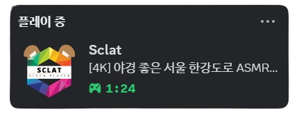

# Sclat

ASCII 아트 기능이 포함된 Python 기반 YouTube 비디오 플레이어입니다.

<p align="center">
    
</p>

## 🌐 언어 | Language

[한국어](README.md) | [English](README.en.md)

## ⚙️ 요구사항

> **중요**: 스트리밍 비디오 호환성을 위해 pytubefix는 반드시 7.1rc2 버전이어야 합니다

-   Python 3.8+
-   pygame
-   OpenCV (cv2)
-   numpy
-   moviepy == 1.0.3
-   chardet == 5.2.0
-   pytubefix == 7.1rc2
-   pyvidplayer2 == 0.9.24
-   yt_dlp == 2024.8.6

자세한 정보는 requirements.txt를 참고하세요.

## 🌟 주요 기능

-   YouTube 동영상 재생 및 다운로드 기능
-   실시간 ASCII 아트 변환 모드
-   직관적인 키보드 컨트롤
-   동영상 검색 기능
-   볼륨 및 재생 제어
-   GUI 및 CLI 인터페이스
-   Discord RPC 기능

## 🚀 실행 방법

### 설치

**Windows**

```batch
install.bat
```

**터미널**

```bash
install.sh
```

### 사용법

**Windows**

```batch
# GUI 모드
start.bat
```

**터미널**

```bash
# GUI 모드
start.sh

# CLI 모드
start.sh --nogui

# 단일 재생
start.sh --once

# 재생목록 모드
start.sh --play [URL1] [URL2]...
```

## 🎮 비디오 컨트롤

### 재생 제어

| 키  | 기능               |
| --- | ------------------ |
| `S` | 비디오 스킵        |
| `R` | 비디오 재시작      |
| `P` | 재생/일시정지      |
| `M` | 음소거/음소거 해제 |
| `L` | 반복 재생 전환     |
| `A` | ASCII 모드 전환    |

### 탐색

| 키  | 기능        |
| --- | ----------- |
| `↑` | 볼륨 증가   |
| `↓` | 볼륨 감소   |
| `←` | 15초 되감기 |
| `→` | 15초 앞으로 |

### 기능

| 키    | 기능                  |
| ----- | --------------------- |
| `esc` | 검색화면으로 돌아가기 |
| `f11` | 전체화면              |

## 🔍 검색 인터페이스

-   비디오 URL 또는 검색어 입력
-   `Ctrl+V`로 URL 붙여넣기
-   방향키로 결과 탐색
-   Enter로 선택 재생

## ✨ Discord RPC

Sclat은 Discord Rich Presence 기능을 지원하여 현재 재생 중인 비디오 정보를 자동으로 Discord 상태에 표시합니다.

<p align="center">
    
</p>

### Discord RPC 키는 방법

Discord RPC 기능을 사용하려면 컴퓨터에서 Discord 프로그램을 실행하면 됩니다. Sclat은 Discord가 실행 중인 경우 자동으로 현재 재생 중인 비디오 정보를 Discord 상태에 표시합니다.

### Discord RPC 끄는 방법

Discord RPC 기능을 비활성화하려면 `setting.json` 파일에서 `discord_RPC` 값을 `false`로 변경하십시오. 기본값은 `true`입니다.

**설정 방법:**

1. Sclat 설치 폴더에서 `setting.json` 파일을 엽니다.
2. `"discord_RPC": true`를 `"discord_RPC": false`로 변경합니다:

    ```json
    {
        "discord_RPC": false
        // 다른 설정 값들...
    }
    ```

3. 파일을 저장하고 프로그램을 다시 실행합니다.
